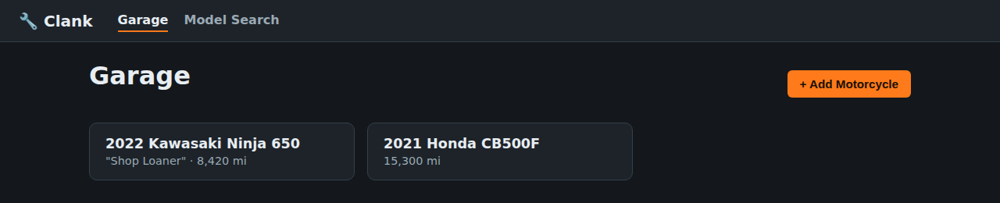

# Clank — Mechanic Shop Dashboard (W.I.P., paused)

> **Status:** Parked. The project's primary focus moved to a mobile-first, local-first app
> (see the repo root README) aimed at individual owners who buy/sell/maintain their own
> motorcycles. This self-hosted LAN dashboard was the original direction, built for a shop
> with multiple mechanics sharing one server over the network. It's fully working and kept
> here in case that use case is worth revisiting later — it just isn't where new work is
> happening right now.

Self-hosted motorcycle maintenance tracker for a shop network. One machine runs the server,
every mechanic on the LAN reaches it from a browser — nothing to install per person.



## Features

- **Garage** — track the motorcycles you own/service (make, model, year, VIN, mileage, notes)
- **Model search** — look up specs by make/model/year via the [API Ninjas Motorcycles API](https://api-ninjas.com/api/motorcycles), cached locally so repeated lookups work offline
- **Maintenance log** — per-motorcycle history of services, parts, cost, who did the work
- **Diagrams** — upload your own manuals/exploded-view diagrams (PDF/PNG/JPEG/WEBP) per motorcycle, plus quick links out to RevZilla/Partzilla/7zap's own search results when you don't have a local copy (there's no public API for OEM parts diagrams, so this app never scrapes or embeds their content)

## Stack

- `server/` — Fastify + TypeScript, SQLite via Drizzle ORM (WAL mode, safe for a handful of concurrent LAN clients)
- `client/` — React + TypeScript + Vite SPA
- In production the server serves the built client too, so the whole app is one process on one port

## Installation

Two ways to run it — Docker is the easiest for most shops.

### Option A: Docker (recommended)

Requirements: Docker Desktop (Windows) or Docker Engine + Compose plugin (Linux)

1. **Install Docker**
   - Windows: download Docker Desktop from docker.com, install, enable the WSL2 backend if prompted, restart your machine.
   - Linux: install via your package manager, or run the official convenience script: `curl -fsSL https://get.docker.com | sh`

2. **Get the code**
   ```bash
   git clone https://github.com/tychoflorent-eng/clank.git
   cd clank/wip-mechanic-shop-dashboard
   ```

3. **(Optional) Set your API key** — this powers model search lookups; everything else works fine without it, and you can always add it later. If you want it now: sign up for a free key at https://api-ninjas.com/api/motorcycles, then make a copy of the example settings file and open it in a plain text editor (Notepad on Windows, gedit/nano on Linux):
   ```bash
   cp .env.example .env
   ```
   Open the new `.env` file, find the line `API_NINJAS_KEY=`, and type your key right after the `=` (no quotes, no spaces). Save and close.

4. **Start the app**
   ```bash
   docker compose up -d --build
   ```
   First run takes a minute or two to build the image.

5. **Open it**
   - On the server itself: http://localhost:4000
   - From any other device on the network: `http://<server's-LAN-IP>:4000` (find the IP with `ip addr` on Linux or `ipconfig` on Windows)

6. **Allow it through the firewall** if other devices can't reach it — open port 4000 on the host.

The database schema migrates itself automatically on startup. Data (database + uploaded diagrams) persists in the `clank-data` Docker volume across restarts/rebuilds.

- **Update:** `git pull` then `docker compose up -d --build` again.
- **Stop:** `docker compose down` (add `-v` only if you want to wipe stored data too).

### Option B: Manual install (no Docker)

Requirements: Node.js 20+, git

1. **Install Node.js 20+**
   - Windows: installer from nodejs.org
   - Linux: via your package manager or nvm

2. **Get the code and install dependencies**
   ```bash
   git clone https://github.com/tychoflorent-eng/clank.git
   cd clank/wip-mechanic-shop-dashboard
   npm install
   ```

3. **(Optional) Set your API key** — powers model search; everything else works without it, and you can add it later.
   ```bash
   cp server/.env.example server/.env
   ```
   Open `server/.env` in a plain text editor (Notepad on Windows, gedit/nano on Linux), find the
   line `API_NINJAS_KEY=`, and type your key (free signup at https://api-ninjas.com/api/motorcycles)
   right after the `=`. Save and close.

4. **Build and start**
   ```bash
   npm run build
   npm start
   ```

The server binds `0.0.0.0:4000` and serves both the API and the built UI, with the database
schema migrated automatically on startup. Find this machine's LAN IP (`ip addr` / `ipconfig`)
and have other mechanics open `http://<that-ip>:4000` in their browser. Open port 4000 in the
host's firewall if needed. To change the port, set `PORT` in `server/.env`.

- **Update:** `git pull`, `npm install`, `npm run build`, then restart `npm start`.

## Development

Runs the API on :4000 and the Vite dev server (with hot reload) on :5173, proxying API calls:

```bash
npm run dev
```

Open http://localhost:5173

## Data storage

- SQLite database and uploaded diagram files live under `data/` (gitignored) when running directly
  with Node, or in the `clank-data` Docker volume when running via Compose. Back this up if you
  care about the maintenance history and uploaded manuals.
